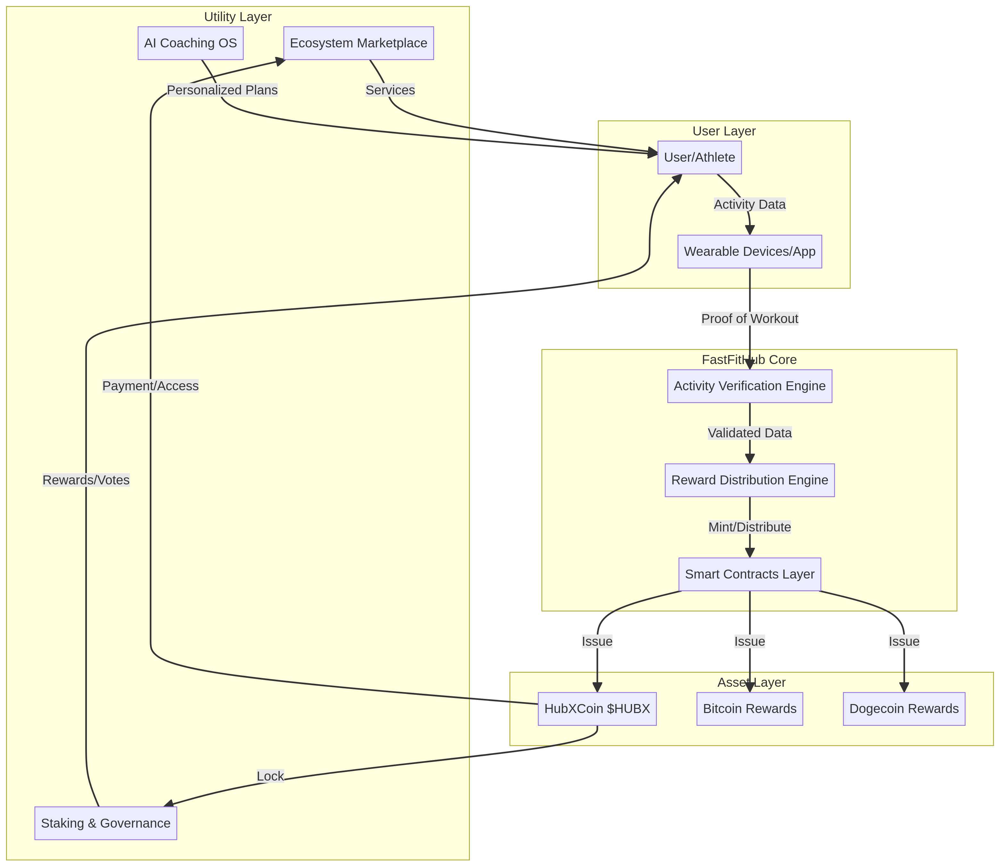
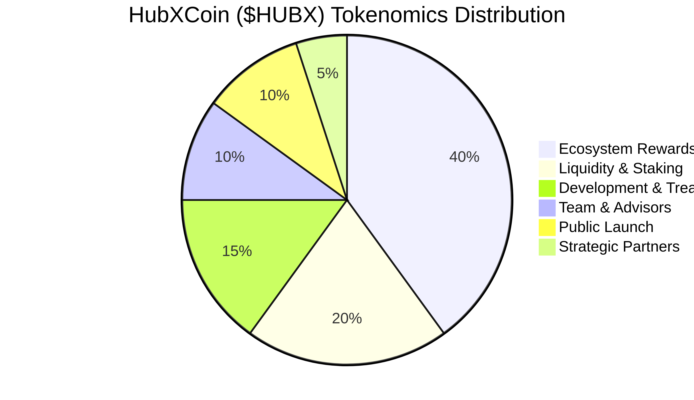

# HubXCoin ($HUBX) - The First Fitness-Backed Digital Asset

## Project Title
**HubXCoin ($HUBX)**: Revolutionizing Fitness with Blockchain Technology

## Asset Definition
**Name**: HubXCoin
**Symbol**: $HUBX
**Type**: Utility Coin
**Primary Function**: Fitness reward and ecosystem utility
**Platform**: FastFitHub

## Short Protocol Overview
HubXCoin ($HUBX) powers the **FastFitHub** ecosystem, a decentralized platform that transforms physical activity into digital value. Utilizing a unique **Proof of Workout** consensus mechanism, $HUBX rewards users for their fitness achievements, fostering a healthier and more engaged global community. This protocol aims to create a sustainable digital economy where discipline and physical performance are directly incentivized.

## Ecosystem Explanation
FastFitHub is a comprehensive Web3 fitness infrastructure designed to be the ultimate coaching and reward system. It integrates:
- **FastFitHub App**: The central hub for tracking workouts, accessing personalized AI coaching, and engaging with the community.
- **Reward Engine**: A sophisticated system that distributes $HUBX and other cryptocurrency bonuses based on verified physical activity.
- **Ecosystem Marketplace**: A decentralized platform where users can spend $HUBX on fitness products, services, and exclusive content.

## Architecture Diagram
Below is a high-level overview of the FastFitHub ecosystem architecture, illustrating the interaction between users, verification mechanisms, and the multi-asset reward system.

## Tokenomics Summary
$HUBX is designed with a robust tokenomics model to ensure long-term sustainability and utility within the FastFitHub ecosystem. The total supply and distribution are carefully planned to incentivize participation, reward performance, and support continuous development.

**Key Allocations:**
- **Ecosystem Rewards (Proof of Workout)**: 40%
- **Liquidity & Staking**: 20%
- **Development & Treasury**: 15%
- **Team & Advisors**: 10%
- **Public Launch**: 10%
- **Strategic Partners**: 5%

## Comparison with Bitcoin and Dogecoin
HubXCoin ($HUBX) carves out a unique niche in the cryptocurrency landscape by focusing on real-world utility tied to physical activity, differentiating itself from established digital assets.

| Feature             | HubXCoin ($HUBX)                                                                         | Bitcoin (BTC)                                                                           | Dogecoin (DOGE)                                                                       |
| :------------------ | :--------------------------------------------------------------------------------------- | :-------------------------------------------------------------------------------------- | :------------------------------------------------------------------------------------ |
| **Primary Purpose** | Utility within FastFitHub ecosystem, fitness rewards, governance, access to services.    | Decentralized digital currency, store of value, hedge against inflation.                | Peer-to-peer digital currency, tipping, community-driven fun.                         |
| **Consensus**       | Proof of Workout (PoW)                                                                   | Proof of Work (PoW)                                                                     | Proof of Work (PoW)                                                                   |
| **Value Driver**    | Utility within FastFitHub, adoption, ecosystem growth, demand for fitness services.      | Scarcity, network effect, security, global acceptance as digital gold.                  | Community sentiment, social media trends, celebrity endorsements.                     |

## Revision History
- **v1.1 (2027)**: Planned ecosystem expansion
- **v1.0 (2026)**: Initial HUBX protocol whitepaper

---

## Download HUBX Whitepaper v1.0 (2026)
[HUBX_Whitepaper_v1.0.pdf](HUBX_Whitepaper_v1.0.pdf)
