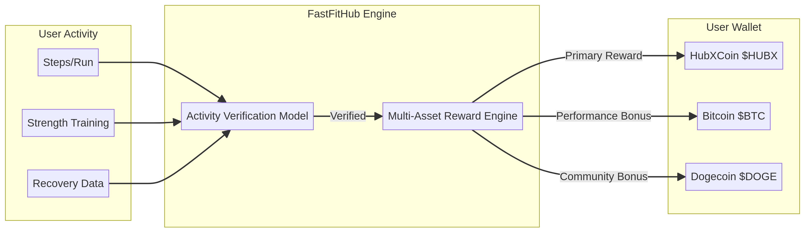

# HubXCoin ($HUBX) Protocol Whitepaper v1.0

## Abstract
This whitepaper introduces **HubXCoin ($HUBX)**, the native digital asset and governance token of the **FastFitHub** ecosystem. $HUBX is designed to power a decentralized platform that incentivizes healthy lifestyles, fosters community engagement, and provides transparent data management within the fitness and wellness industry. By integrating a unique **Proof of Workout** activity verification model, FastFitHub aims to bridge the gap between physical effort and digital value, creating a self-sustaining economy for fitness enthusiasts worldwide.

## 1. Introduction
The traditional health and fitness industry is plagued by centralized control, opaque data practices, and short-lived incentive models. Existing platforms often fail to adequately reward consistent physical effort, leading to a lack of sustained user engagement. FastFitHub leverages blockchain technology to address these challenges, introducing **HubXCoin ($HUBX)** as a utility coin that rewards discipline and physical performance.

## 2. FastFitHub Ecosystem Overview
FastFitHub is a comprehensive fitness AI infrastructure designed to be the "last coaching OS" a user will ever need. The ecosystem includes:
- **Fitness Tracker dApp**: Records and verifies physical activity through wearable integration.
- **AI Coaching OS**: Provides personalized, data-driven fitness and nutrition plans.
- **Rewards Engine**: Distributes $HUBX and other assets based on verified performance.
- **Ecosystem Marketplace**: A decentralized marketplace for health products and services.

## 3. Protocol Architecture
The FastFitHub protocol is built on a high-throughput blockchain layer, ensuring low-latency transactions and high scalability. The architecture consists of four primary layers:
1. **User Layer**: Interface for athletes and wearable devices.
2. **Core Engine**: Activity verification and reward distribution logic.
3. **Smart Contract Layer**: Immutable execution of tokenomics and governance.
4. **Asset Layer**: Management of $HUBX, BTC, and DOGE reward pools.

## 4. Activity Verification Model
Unlike Bitcoin's Proof of Work (PoW) or Ethereum's Proof of Stake (PoS), FastFitHub introduces **Proof of Workout**. This model uses cryptographic verification of data from wearable devices (heart rate, GPS, movement patterns) to ensure that rewards are only distributed for genuine physical activity. This prevents "gaming" the system and ensures the integrity of the asset's value backing.

## 5. Token Issuance Mechanism
$HUBX is issued through a performance-based minting process. As users complete verified workouts, the protocol mints a predetermined amount of $HUBX from the ecosystem reward pool. The issuance rate is subject to "difficulty adjustments" similar to Bitcoin, ensuring that as the network grows, the effort required to earn $HUBX increases, maintaining scarcity.

## 6. Tokenomics
**Asset Specification:**
- **Name**: HubXCoin
- **Symbol**: $HUBX
- **Type**: Utility Coin
- **Primary Function**: Fitness reward and ecosystem utility
- **Platform**: FastFitHub

**Distribution:**
- **Ecosystem Rewards (Proof of Workout)**: 40%
- **Liquidity & Staking**: 20%
- **Development & Treasury**: 15%
- **Team & Advisors**: 10%
- **Public Launch**: 10%
- **Strategic Partners**: 5%

## 7. Token Utility
$HUBX serves multiple roles within the ecosystem:
- **Rewards**: Earned through physical activity.
- **Payments**: Used to purchase premium coaching, supplements, and gear in the marketplace.
- **Staking**: Lock $HUBX to earn yield and access higher reward tiers.
- **Governance**: Vote on protocol upgrades and ecosystem development.

## 8. Multi-Asset Reward Model (Bitcoin / Dogecoin / $HUBX)
FastFitHub offers a unique multi-asset reward system. While $HUBX is the primary utility coin, top-performing users can earn bonuses in established assets:
- **$HUBX**: Standard reward for all verified activity.
- **Bitcoin ($BTC)**: Bonus for elite performance and long-term consistency.
- **Dogecoin ($DOGE)**: Community-driven rewards for social engagement and challenges.

## 9. Ecosystem Flow
The flow of value within the ecosystem is designed to be circular and self-sustaining:
1. **Activity**: User performs a workout.
2. **Verification**: Protocol validates activity via Proof of Workout.
3. **Distribution**: User receives $HUBX/BTC/DOGE rewards.
4. **Utilization**: User spends $HUBX in the marketplace or stakes for governance.

## 10. Roadmap
- **v1.0 (2026)**: Initial HUBX protocol whitepaper launch and alpha testing of Proof of Workout.
- **v1.1 (2027)**: Planned ecosystem expansion, including global marketplace launch and cross-chain integrations.
- **v2.0 (2028)**: Full decentralization via DAO governance and AI coaching OS integration.

## 11. Security and Transparency
Security is paramount. All smart contracts are audited by leading security firms. Activity data is handled with privacy-preserving technologies, ensuring that while performance is verified, personal health data remains under the user's control.

## 12. Founder Section
FastFitHub was founded by a team of fitness experts, blockchain developers, and AI researchers dedicated to democratizing fitness incentives. Our mission is to reward the world's discipline through technology.

## 13. Legal Disclaimer
**HubXCoin ($HUBX) is a utility coin** specifically designed for use within the FastFitHub ecosystem. It is not intended to be a security, investment contract, or financial instrument in any jurisdiction. Participation in the FastFitHub ecosystem involves risks, and users should perform their own due diligence. The project team makes no guarantees regarding the future value or liquidity of $HUBX.

---
**Download HUBX Whitepaper v1.0 (2026)**
[HUBX_Whitepaper_v1.0.pdf](HUBX_Whitepaper_v1.0.pdf)
